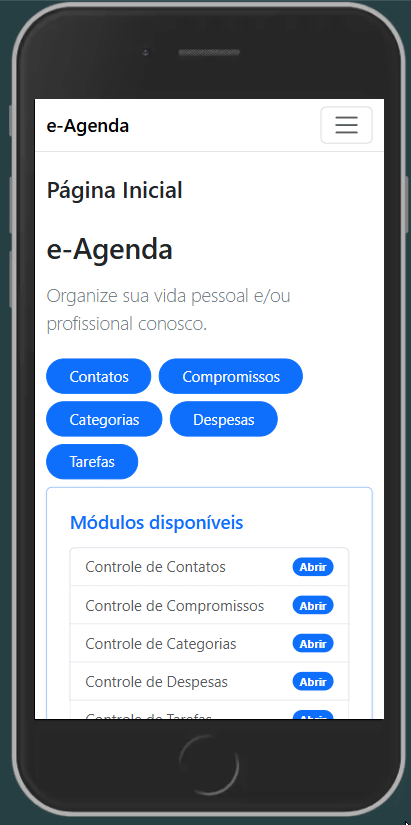

<div align="center">

# 📅 E-AGENDA

### Sistema de organização pessoal em **ASP.NET MVC COM AZURE**
Controle de contatos, compromissos, despesas, categorias e tarefas com separação de responsabilidades e regras de negócio reais.

---


</div>

---

## 📌 Sobre o Projeto

A **E-AGENDA** é um sistema completo de organização do dia a dia. A aplicação reúne em um só lugar o gerenciamento de contatos, agendamento de compromissos, controle de despesas e acompanhamento de tarefas — tudo com validações robustas, persistência em banco de dados e publicação em nuvem.

O projeto foi desenvolvido com foco em:

- Organização em camadas (MVC)
- Separação de responsabilidades
- Regras de negócio reais
- Persistência de dados com Entity Framework
- Pipeline de CI/CD com GitHub Actions
- Interface web responsiva e intuitiva

---

## 🎬 Demonstração

> _Adicione abaixo o GIF demonstrando o funcionamento da aplicação_

<!-- Substitua pelo seu GIF -->


---

## 🌐 Acesse no Navegador

A aplicação está publicada e disponível online — sem necessidade de instalação:

**👉 [Acessar E-Agenda](https://e-agendawebpingdev51-gxhqdffshjeddnbn.centralus-01.azurewebsites.net/)**

---

## ✅ Funcionalidades

### 👤 Contatos

- Cadastro de contatos
- Visualização, edição e exclusão

**Regras:**
- Nome obrigatório (2 a 100 caracteres)
- Email obrigatório (formato válido)
- Telefone obrigatório (formato `(XX) XXXX-XXXX` ou `(XX) XXXXX-XXXX`)
- Cargo e Empresa opcionais
- Não é permitido cadastrar contatos com o mesmo email ou telefone
- Não é permitido excluir um contato com compromissos vinculados

---

### 📆 Compromissos

- Cadastro de compromissos
- Visualização, edição e exclusão

**Regras:**
- Assunto obrigatório (2 a 100 caracteres)
- Data de ocorrência, hora de início e hora de término obrigatórios
- Tipo obrigatório: `Remoto` ou `Presencial`
- Local obrigatório para compromissos presenciais
- Link obrigatório para compromissos remotos
- Contato opcional
- Não são permitidos conflitos de horários entre compromissos

---

### 🏷️ Categorias

- Cadastro de categorias
- Visualização, edição e exclusão
- Visualização de todas as despesas de uma categoria específica

**Regras:**
- Título obrigatório (2 a 100 caracteres)
- Não é permitido cadastrar categorias com o mesmo título
- Não é permitido excluir uma categoria vinculada a despesas

---

### 💸 Despesas

- Cadastro de despesas
- Visualização, edição e exclusão

**Regras:**
- Descrição obrigatória (2 a 100 caracteres)
- Data de ocorrência opcional (data de cadastro usada por padrão)
- Valor obrigatório (R$)
- Forma de pagamento obrigatória: `À Vista`, `Crédito` ou `Débito`
- Uma ou mais categorias obrigatórias

---

### ✅ Tarefas

- Cadastro de tarefas com itens internos
- Visualização de todas as tarefas, pendentes e concluídas
- Agrupamento por prioridade
- Adição e remoção de itens por tarefa
- Atualização automática do percentual de conclusão ao concluir itens

**Regras:**
- Título obrigatório (2 a 100 caracteres)
- Prioridade obrigatória: `Baixa`, `Normal` ou `Alta`
- Data de criação e data de conclusão obrigatórias
- Percentual de conclusão atualizado automaticamente conforme os itens são concluídos
- Itens da tarefa opcionais, cada um com título (2 a 100 caracteres) e status de conclusão

---

## 🧠 Conceitos Aplicados

| Conceito | Aplicação |
|---|---|
| 🏗️ Classes e Objetos | Modelagem das entidades do sistema |
| 🔒 Encapsulamento | Proteção dos dados internos |
| 📐 Padrão MVC | Separação entre Model, View e Controller |
| ⚙️ Regras de Negócio | Validações, restrições e cálculos automáticos |
| 🗄️ Entity Framework | Persistência de dados em banco relacional |
| 🌐 Publicação em Nuvem | Aplicação e banco hospedados em ambiente cloud |
| 🔁 GitHub Actions | Pipeline de CI/CD com build e testes automatizados |
| 🔗 Comunicação entre Classes | Integração entre os módulos |

---

## ⚙️ Tecnologias Utilizadas

- C#
- ASP.NET MVC
- Entity Framework Core
- Bootstrap
- GitHub Actions
- Azure (publicação em nuvem)

---

## ▶️ Como Executar Localmente

### 1. Clone o repositório

```bash
git clone https://github.com/PingDev-51/E-Agenta-Web.git
```

### 2. Acesse a pasta do projeto

```bash
cd agenda-pessoal
```

### 3. Configure a string de conexão

No arquivo `appsettings.json`, ajuste a string de conexão com o seu banco de dados:

```json
"ConnectionStrings": {
  "DefaultConnection": "Server=seu-servidor;Database=AgendaPessoal;Trusted_Connection=True;"
}
```

### 4. Aplique as migrations

```bash
dotnet ef database update
```

### 5. Execute o projeto

```bash
dotnet run --project AgendaPessoal.WebApp
```

### 6. Acesse no navegador

```
https://localhost:5001
```

---

## 📋 Requisitos

- .NET SDK instalado
- Visual Studio 2022 ou superior
- SQL Server ou banco compatível com Entity Framework Core

---

## 🎯 Objetivo de Aprendizado

Este projeto foi desenvolvido para praticar:

- ✔️ Desenvolvimento de aplicações web com ASP.NET MVC
- ✔️ Persistência de dados com Entity Framework Core
- ✔️ Publicação de aplicações em nuvem
- ✔️ Configuração de pipelines CI/CD com GitHub Actions
- ✔️ Estilização responsiva com Bootstrap
- ✔️ Modelagem de entidades reais com regras de negócio
- ✔️ Organização modular e código limpo

---

## 👨‍💻 Autores

<div align="center">

Desenvolvido como parte dos estudos em **C# Desenvolvimento Web, Banco de dados sql e azure** na **Academia do Programador**.

[](https://github.com/KauanGalvani)
[](https://github.com/k-silvax19)